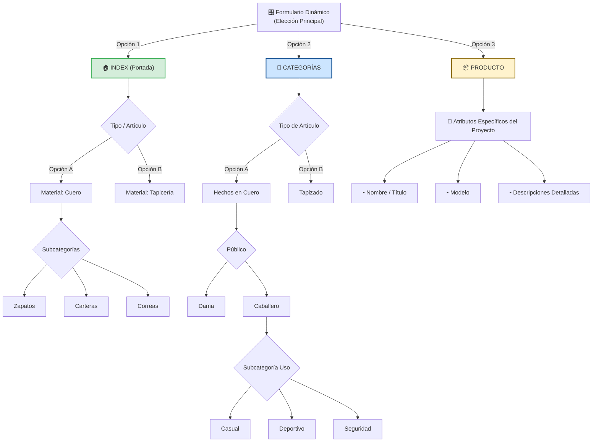

# TXevolution - Sistema de Gestión para CalzadosC3 👞

## 📝 Descripción
Transformación digital y sistémica para artesanos del cuero. TXevolution eleva el negocio mediante la automatización de procesos y visibilidad comercial no es solo una solución tecnológica, es la transformación y evolución de los negocios. Este sistema integral para CalzadosyTapiceriaC3 permite la gestión profesional de catálogos y presupuestos para el sector artesanal del cuero.

**Tabla de Contenidos**
*   [Características Principales](#características-principales)

*   [Arquitectura del Sistema](#arquitectura-del-sistema)

*   [Tecnologías Utilizadas](#tecnologías-utilizadas)

*   [Esquema de Base de Datos](#esquema-de-base-de-datos)

*   [Seguridad y RLS](#seguridad-y-rls)
*   [Instalación y Configuración]

(#instalación-y-configuración)
*   [Mejoras Futuras](#mejoras-furas)
## 🌟 Características Principales
*   **Autenticación Robusta:** Gestión de usuarios mediante Supabase Auth integrada con perfiles personalizados.

*   **Gestión de Catálogo:** Administración de productos artesanales en cuero.

*   **Sincronización Idempotente:** Sistema de registro diseñado para evitar colisiones de datos y asegurar la integridad de los perfiles.

*   **Diseño Minimalista:** Interfaz enfocada en la experiencia de usuario (UX) con estética profesional.

## 🏗️ Arquitectura del Sistema
"El sistema sigue una arquitectura desacoplada a nivel de infraestructura para facilitar la escalabilidad, organizada internamente bajo principios de dominio para asegurar que la lógica de negocio de CalzadosC3 sea el núcleo del desarrollo".
## 🛠️ Evolución Técnica y Refactorización

Actualmente, este proyecto se encuentra en una etapa de refactorización activa para transformar el sistema original en una arquitectura modular, escalable y mantenible. Mi objetivo principal es profesionalizar la base de código y asegurar la correcta separación de responsabilidades.

### Avances y Cambios Realizados
He aplicado un patrón de diseño basado en capas, lo que permite un desarrollo más limpio y fácil de probar:

*   **Modularización del Frontend:** He migrado la lógica del componente `AdminLogin.jsx` hacia una estructura de capas dedicada:
    *   **`services/`**: Encapsulación de la lógica de comunicación con la API (infraestructura).
    *   **`hooks/`**: Centralización de la lógica de estado (`useAuth`, `useForm`), permitiendo reutilizar el comportamiento en toda la aplicación.
    *   **`context/`**: Implementación de `AuthContext` como fuente única de verdad para la sesión del usuario, eliminando el *prop drilling*.
    *   **`pages/`**: Limpieza del componente de vista, delegando toda la complejidad a los servicios y hooks.

```text
sistema_de_gestion_de_presupuestos_y_pedidos_online/
├── 🌐 frontend/                # CAPA VISUAL (React + Vite + Tailwind)
│   ├── src/
│   │   ├── api/               # Capa de infraestructura (config. axios/fetch)
│   │   │   └── httpClient.js
│   │   ├── services/           # Lógica de negocio (authService, etc.)
│   │   │       └── authService.js
│   │   ├── context/            # Estado global (AuthContext)
│   │   │   └── AuthContext.jsx
│   │   ├── hooks/              # Lógica reutilizable (useAuth)
│   │   │   └── useAuth.js
│   │   ├── components/         # UI reutilizable
│   │   │    └── Common/
│   │   ├── pages/              # Fachada / Vistas finales
│   │   ├── routes/             # Gestión de rutas y seguridad
│   │   │   └── index.jsx
│   │   ├── App.jsx             # Punto de entrada
│   │   └── index.css           # Estilos globales
│   ├── public/                 # Assets (logos, iconos)
│   ├── package.json            # Dependencias
│   ├── vite.config.js          # Configuración de Vite
│   ├── tailwind.config.js      # Configuración de Tailwind
│   └── dist/                   # Build de producción
│
├── ⚙️ backend/                 # CAPA DE LÓGICA (Python + FastAPI)
│   ├── src/
│   │   ├── api/                # 📂 CONTENEDOR MAESTRO DE MÓDULOS
│   │   │   ├── auth/           # Seguridad (deps, routers, service)
│   │   │   ├── admin/          # Administración
│   │   │   ├── gestion_catalogo/   # Catálogo
│   │   │   ├── gestion_costos/ # Insumos y materiales
│   │   │   ├── gestion_pagos/  # Finanzas
│   │   │   ├── solicitudes/    # Pedidos activos
│   │   │   ├── trazabilidad/   # Seguimiento
│   │   │   ├── reviews/        # Valoraciones
│   │   │   ├── users/          # Perfiles
│   │   │   ├── motor_presupuesto/ 
│   │   │   └── historia_de_pedidos/
│   │   ├── core/               # Configuración global
│   │   ├── services/           # Lógica compartida
│   │   └── main.py             # Punto de entrada FastAPI
│   ├── alembic/                # Migraciones de BD
│   └── requirements.txt        # Dependencias Python
│
├── 🗄️ supabase/                # PERSISTENCIA Y DATOS
│   ├── migrations/             # Esquemas SQL
│   └── seed_admin.sql          # Script inicialización admin
│
└── 📝 README.md                # DOCUMENTACIÓN TÉCNICA
```
****me encuentro 


Este bloque explica **por qué** cada decisión arquitectónica es racional y cómo protege el futuro de **Sistema gestion de presupuesto y pedidos C3**:


### 🔬 Justificación de la Arquitectura y Escalabilidad

El **Sistema de Gestión de Presupuestos y Pedidos Online** ha sido diseñado bajo estándares de **Ingeniería de Sistemas**, priorizando el mantenimiento a largo plazo y la capacidad de evolución tecnológica.

#### 1. Separación de Responsabilidades (SoC)

* **Frontend Modular**: El uso de **React** y **Vite** permite una interfaz ultra rápida donde la lógica de la interfaz está desacoplada de la lógica de negocio.
* **Backend Atómico**: La estructura en `src/api/` organiza el software en módulos independientes (como `auth`, `gestion_costos` y `motor_presupuesto`). Esto evita el "código espagueti", permitiendo modificar un módulo sin afectar la estabilidad de los demás.


---
#### 2. Seguridad y Encapsulamiento

* **Gestión de Identidad**: El módulo `auth` posee su propia lógica interna de servicios (`service.py`), garantizando que los procesos de seguridad (hashing y JWT) estén aislados de los servicios globales del sistema.
* **Guardians de Ruta**: Se implementan validaciones tanto en el frontend (`ProtectedRoute.jsx`) como en el backend (`dependencies.py`), creando un sistema de seguridad de doble capa.

#### 3. Diseño Preparado para Migraciones (Future-Proof)

* **Independencia de Base de Datos**: Gracias a **Alembic** y **SQLAlchemy**, el sistema no tiene dependencia crítica de un proveedor específico. Se puede migrar de **Supabase** a cualquier otro motor SQL actualizando solo las variables de entorno.
* **Contratos de Datos (Pydantic)**: Los esquemas de validación aseguran que, ante cualquier cambio en la base de datos, el flujo de información hacia el cliente permanezca íntegro y sin errores.

#### Propuestas de Mejora Continua

* **Dockerización**: Implementación de contenedores para asegurar que el entorno de desarrollo y producción sean idénticos.
* **Centralización de Logs**: Creación de un servicio global de auditoría en `backend/src/services/` para monitorear transacciones críticas en el módulo de `gestion_pagos`.
* **Automatización de Pruebas**: Incorporación de tests unitarios para validar que cada actualización en el `motor_presupuesto` mantenga la precisión matemática de las cotizaciones.

---

### Matriz de Robustez Técnica

| Característica | Implementación | Beneficio para el Negocio |
| --- | --- | --- |
| **Escalabilidad** | Estructura Modular | Permite añadir nuevas funciones (ej. Módulo **Ferremax**) sin reescribir el núcleo. |
| **Migración** | Alembic + Pydantic | Evita el "Vendor Lock-in", facilitando cambios de hosting o base de datos. |
| **Seguridad** | JWT + Guardians | Protege la información sensible de los clientes y el artesano. |
### 🛠️ Patrones de Diseño y Arquitectura de Software
El **Sistema de Gestión de Presupuestos y Pedidos Online** implementa una arquitectura modular fundamentada en patrones de diseño industriales para asegurar escalabilidad y mantenibilidad.

| Patrón de Diseño | Aplicación en el Proyecto | Propósito Técnico |
| --- | --- | --- |
| **Controller-Service-Repository** | Aplicado en módulos como `auth`, `gestion_pagos` y `motor_presupuesto`. | **Separación de responsabilidades**: Los routers gestionan la entrada, los services la lógica y los modelos el acceso a datos. |
| **DTO (Data Transfer Objects)** | Implementado mediante esquemas **Pydantic** en la carpeta `api/`. | **Validación y seguridad**: Garantiza que solo los datos validados entren al sistema, protegiendo la integridad de la base de datos. |
| **Entity Model** | Mapeo objeto-relacional (ORM) a través de **SQLAlchemy**. | **Abstracción de Datos**: Permite que el sistema sea independiente del motor de base de datos (PostgreSQL/MySQL). |
| **Guard (Dependencies)** | Inyección de dependencias ubicada en `auth/dependencies.py`. | **Control de Acceso**: Actúa como un centinela que valida tokens JWT antes de permitir el acceso a rutas protegidas. |
| **Interceptor / Middleware** | Gestión de CORS y Logging centralizado en el núcleo del backend. | **Auditoría**: Facilita el monitoreo de transacciones y la transformación de respuestas de forma global. |
| **Decorators** | Uso de decoradores nativos de **FastAPI** (`@router.get`, `@app.post`). | **Metadatos**: Simplifica la inyección de dependencias y genera automáticamente la documentación técnica (Swagger). |

---

### 🔬 Racionalidad de la Implementación en Autenticación

Como ingeniera, la aplicación de estos patrones en el módulo de **Autenticación** responde a una visión de seguridad y crecimiento estratégico para la marca **EVOLVEX**:

* **Encapsulamiento de Identidad**: El módulo `auth` posee su propia lógica interna de servicios (`service.py`), asegurando que los procesos de hashing y JWT estén aislados de los servicios globales.
* **Seguridad de Doble Capa**: Se implementan validaciones y protecciones tanto en el frontend (`ProtectedRoute.jsx`) como en el backend (`dependencies.py`), creando un entorno seguro para los datos del negocio.
* **Migración Flexible**: El uso de **Entity Models** y **Alembic** asegura que el proyecto sea portable entre proveedores de nube (como **Supabase**) o bases de datos locales sin reescribir la lógica de seguridad.

---


##  Tecnologías
  - **Arquitectura:** Modular por Dominios (Clean Architecture)
- **Frontend:** React + Tailwind CSS
    **Backend:** FastAPI Python 3.10+ Supabase (Auth/DB)
*   **Framework Web:** FastAPI
*   **Base de Datos:** PostgreSQL (Supabase)
*   **Herramientas de Automatización:** n8n (planificado para workflows)/implentacion futura
*   **Seguridad:** Row Level Security (RLS) y JWT##
## 🗄️ Esquema de Base de Datos
La base de datos utiliza el esquema `public` para la lógica de negocio, vinculado al esquema `auth` del sistema:


### 🔐 Sistema de Autenticación

| Característica | Descripción |
| :--- | :--- |
| **Registro de usuarios** | Validación de email único, contraseñas encriptadas con bcrypt  Implementamos la validación de email único y el manejo de errores para asegurar la integridad de la base de datos (idempotencia) para que el sistema no falle si un usuario intenta registrarse dos veces|
| **Login/Logout** | JWT tokens con expiración configurable |
| **Refresh tokens** | Sesiones prolongadas seguras con Supabase para que el usuario no tenga que loguearse a cada momento |
| **Recuperación de contraseña** | Tokens temporales via email |
| **Roles de usuario** | `client` y `admin` con permisos diferenciados y rutas de acceso distintas |
| **security dependency** | Dependencies de FastAPI|

## 📂 Estructura de Módulos (Arquitectura del Sistema)

A continuación se detallan los módulos que componen la lógica de negocio , diseñados bajo principios de modularidad y alta mantenibilidad.

| Módulo (Carpeta) | Responsabilidad en el Sistema | Estado |
| :--- | :--- | :--- |
| 🔐 **`auth`** | Gestión de identidad, login, registro y seguridad JWT. | **Completado** |
| 👤 **`admin` / `users`** | Control de perfiles y niveles de acceso (ADM vs Cliente). | **Completado** |
| 🖼️ **`vitrina`** | Catálogo digital y portafolio interactivo para **CalzadosC3**. | **En Desarrollo** |
| 💰 **`gestion_costos`** | Control de insumos y gastos operativos de fabricación. | **En Desarrollo** |
| ⚙️ **`motor_presupuesto`** | Lógica de cálculo de cotizaciones personalizadas. | **En Desarrollo** |
| 📝 **`solicitudes`** | Gestión de pedidos por encargo y requerimientos del cliente. | **Planificado** |
| 💵 **`gestion_pagos`** | Registro de abonos y saldos (Manual: Transferencia/Efectivo). | **Planificado** |
| 📍 **`trazabilidad`** | Seguimiento del estado de fabricación (Corte, Costura, Terminado). | **Planificado** |
| 📜 **`historia_de_pedidos_y_pagos`** | Auditoría y registro histórico de transacciones finalizadas. | **Planificado** |
| ⭐ **`reviews`** | Sistema de retroalimentación y testimonios de clientes. | **Planificado** |

### 👑 Panel Administrativo: Flujo de Gestión Completo

Este panel centraliza la operación de **CalzadosC3**, organizando las herramientas según el ciclo de vida del producto artesanal.

| Orden en Sidebar | Módulo (Carpeta) | Funcionalidad Específica |
| :--- | :--- | :--- |
| **1. 🔔 Notificaciones** | `trazabilidad` | Alertas de nuevas solicitudes y cambios de estado en tiempo real. |
| **2. 📥 Solicitudes** | `solicitudes` | Gestión de pedidos por encargo, filtrando entre Pendientes y Activas. |
| **3. 📤 Cargar Portafolio** | `vitrina` | Carga de imágenes y descripciones para la vitrina digital de la marca. |
| **4. 💰 Gestión de Costos** | `gestion_costos` | Registro de gastos en materia prima (cuero, suelas, pegamentos). |
| **5. ⚙️ Motor Presupuesto** | `motor_presupuesto` | Generador de cotizaciones automáticas basadas en costos + margen. |
| **6. 💵 Gestión de Pagos** | `gestion_pagos` | Control manual de abonos y saldos pendientes de los clientes. |
| **7. 📊 Analytics** | `analytics_dashboard` | Dashboard con métricas de ventas, KPIs y rendimiento del taller. |
## 📝 Resumen del Proyecto y Roadmap de Desarrollo
## 🔄 Flujo de Gestión y Renderizado Dinámico de Productos

Este proyecto utiliza un sistema de arquitectura desacoplada para la gestión de catalogo, donde el panel de administración (CMS interno) controla dinámicamente la disponibilidad y ubicación de los artículos en el frontend a través de estados en la Base de Datos y almacenamiento externo de archivos.



**Txevolution** no es solo una solución tecnológica, sino una transformación sistémica diseñada para elevar los procesos de negocio de **CalzadosC3**. Actualmente, el desarrollo se encuentra en una fase activa de transición desde  un **Full-Stack** robusto utilizando **Python** y **SQL** hacia el  **frontend** y en proceso de refactorizacion par acumplir con los estandares de la arquitectura como un proceso de mejora continua . 

### 🛠️ Estado de Implementación (Sprint Actual)
1. **Autenticación y Seguridad**: Implementación de Login/Registro diferenciado por roles (Admin/Cliente) con protección JWT.
2. **Arquitectura del Dashboard**: Maquetación del panel administrativo con jerarquía de navegación   
. basada en la prioridad operativa: **Notificaciones > Solicitudes > Gestión de Portafolio**.
3. **Gestión de Negocio**: Desarrollo del **Motor de Presupuesto** y **Gestión de Costos**, separando la lógica de insumos de la rentabilidad del artesano.

### 🚀 Metodología
El proyecto se gestiona bajo metodologías ágiles (**Scrum**), utilizando **Jira** para el seguimiento de tareas y **Figma/Miro** para el prototipado de interfaces de usuario.
